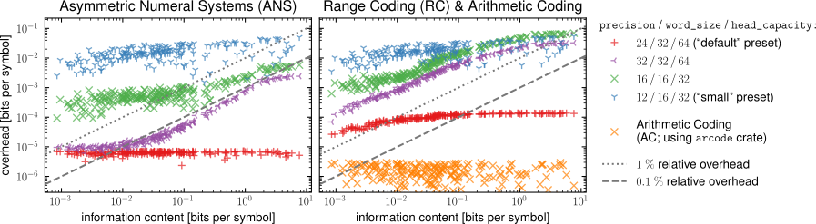
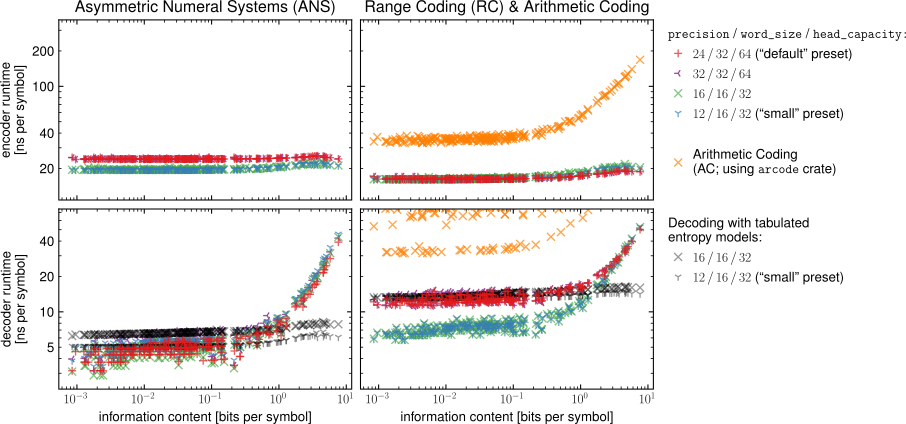

# Entropy Coders for Research and Production


The `constriction` library provides a set of composable entropy coding algorithms with a
focus on correctness, versatility, ease of use, compression performance, and
computational efficiency. The goals of `constriction` are three-fold:

1. **to facilitate research on novel lossless and lossy compression methods** by
   providing a *composable* set of primitives (e.g., you can can easily switch out a
   Range Coder for an ANS coder without having to find a new library or change how you
   represent exactly invertible entropy models);
2. **to simplify the transition from research code to deployed software** by providing
   similar APIs and binary compatible entropy coders for both Python (for rapid
   prototyping on research code) and Rust (for turning successful prototypes into
   standalone binaries, libraries, or WebAssembly modules); and
3. **to serve as a teaching resource** by providing a variety of entropy coding
   primitives within a single consistent framework. Check out our [additional teaching
   material](https://robamler.github.io/teaching/compress21/) from a university course
   on data compression, which contains some problem sets where you use `constriction`
   (with solutions).

**More Information:** [project website](https://bamler-lab.github.io/constriction)

**Live demo:** [here's a web app](https://robamler.github.io/linguistic-flux-capacitor)
that started out as a machine-learning research project in Python and was later turned
into a web app by using `constriction` in a WebAssembly module.

## Project Status

We currently provide implementations of the following entropy coding algorithms (see also [benchmarks](#benchmarks) below):

- **Asymmetric Numeral Systems (ANS):** a fast modern entropy coder with near-optimal
  compression effectiveness that supports advanced use cases like bits-back coding.
- **Range Coding:** a computationally efficient variant of Arithmetic Coding that has
  essentially the same compression effectiveness as ANS Coding but operates as a queue
  ("first in first out"), which makes it preferable for autoregressive models.
- **Chain Coding:** an experimental new entropy coder that combines the (net) effectiveness
  of stream codes with the locality of symbol codes (for details, see Section&nbsp;4.3 in
  [this paper](https://arxiv.org/pdf/2201.01741)); it admits experimental new compression
  techniques that perform joint inference, quantization, and bits-back coding in an
  end-to-end optimization. This experimental coder is mainly provided to prove to ourselves
  that the API for encoding and decoding, which is shared across all stream coders, is
  flexible enough to express complex novel tasks.
- **Huffman Coding:** a well-known symbol code, mainly provided here for teaching purpose;
  you'll usually want to use a stream code like ANS or Range Coding instead since symbol
  codes can have a considerable overhead on the bit rate, especially in the regime of low
  entropy per symbol, which is common in machine-learning based compression methods.

Further, `constriction` provides implementations of common probability distributions in
fixed-point arithmetic, which can be used as entropy models in either of the above stream
codes. The library also provides adapters for turning custom probability distributions into
exactly invertible fixed-point arithmetic.

The provided implementations of entropy coding algorithms and probability distributions are
continuously and extensively tested. We consider updates that can affect the encoder or
decoder output in existing code as breaking changes that necessitate a bump in the leading
nonzero number of the version string (this is a stronger guarantee than SemVer in that we
apply it even to 0.y.z versions). Please [file an
issue](https://github.com/bamler-lab/constriction/issues) if you find a bug, are missing a
particular feature, or run into a scenario where the current APIs are confusing or
unnecessarily limit what you can achieve with `constriction`.

## Quick Start Guides And Examples in Python and Rust

### Python

Install `constriction` for Python:

```bash
pip install constriction~=0.3.2
```

Then go ahead and encode and decode some data:

```python
import constriction
import numpy as np

message = np.array([6, 10, -4, 2, 5, 2, 1, 0, 2], dtype=np.int32)

# Define an i.i.d. entropy model (see links below for more complex models):
entropy_model = constriction.stream.model.QuantizedGaussian(-50, 50, 3.2, 9.6)

# Let's use an ANS coder in this example (see links below for Range Coding examples).
encoder = constriction.stream.stack.AnsCoder()
encoder.encode_reverse(message, entropy_model)

compressed = encoder.get_compressed()
print(f"compressed representation: {compressed}")
print(f"(in binary: {[bin(word) for word in compressed]})")

decoder = constriction.stream.stack.AnsCoder(compressed)
decoded = decoder.decode(entropy_model, 9) # (decodes 9 symbols)
assert np.all(decoded == message) # (verifies correctness)
```

There's a lot more you can do with `constriction`'s Python API. Please check out the [Python
API Documentation](https://bamler-lab.github.io/constriction/apidoc/python/) or our [example
jupyter notebooks](https://github.com/bamler-lab/constriction/tree/main/examples/python).

### Rust

Add this line to your `Cargo.toml`:

```toml
[dependencies]
constriction = "0.3.2"
probability = "0.17" # Not strictly required but used in many code examples.
```

If you compile in `no_std` mode then you have to deactivate `constriction`'s default
features (and you can't use the `probability` crate):

```toml
[dependencies]
constriction = {version = "0.3.2", default-features = false} # for `no_std` mode
```

Then go ahead and encode and decode some data:

```rust
use constriction::stream::{model::DefaultLeakyQuantizer, stack::DefaultAnsCoder, Decode};

// Let's use an ANS Coder in this example. Constriction also provides a Range
// Coder, a Huffman Coder, and an experimental new "Chain Coder".
let mut coder = DefaultAnsCoder::new();
 
// Define some data and a sequence of entropy models. We use quantized Gaussians here,
// but `constriction` also provides other models and allows you to implement your own.
let symbols = [23i32, -15, 78, 43, -69];
let quantizer = DefaultLeakyQuantizer::new(-100..=100);
let means = [35.2f64, -1.7, 30.1, 71.2, -75.1];
let stds = [10.1f64, 25.3, 23.8, 35.4, 3.9];
let models = means.iter().zip(&stds).map(
    |(&mean, &std)| quantizer.quantize(probability::distribution::Gaussian::new(mean, std))
);

// Encode symbols (in *reverse* order, because ANS Coding operates as a stack).
coder.encode_symbols_reverse(symbols.iter().zip(models.clone())).unwrap();

// Obtain temporary shared access to the compressed bit string. If you want ownership of the
// compressed bit string, call `.into_compressed()` instead of `.get_compressed()`.
println!("Encoded into {} bits: {:?}", coder.num_bits(), &*coder.get_compressed().unwrap());

// Decode the symbols and verify correctness.
let reconstructed = coder.decode_symbols(models).collect::<Result<Vec<_>, _>>().unwrap();
assert_eq!(reconstructed, symbols);
```

There's a lot more you can do with `constriction`'s Rust API.
Please check out the [Rust API
Documentation](https://docs.rs/constriction).

## Benchmarks

The following table and diagrams show empirical bit rates and run-time performances of the two main entropy coders provided by `constriction`: *Range Coding* (RC) and *Asymmetric Numeral Systems* (ANS).
We compare both to *Arithmetic Coding* (AC), as implemented in the [arcode crate](https://github.com/cgbur/arcode-rs).
The reported results are from experiments with data that came up in [a real-world application](https://robamler.github.io/linguistic-flux-capacitor/).
In each experiment, we compressed a message that consists of 3 million symbols, which we modeled as i.i.d. within each message.
The messages span a wide range of entropy from about 0.001 to 10 bits per symbol.
Reported run times for encoding and decoding were observed on an Intel Core i7-7500U CPU (2.70 GHz) using `constriction`s Rust API (runtimes of `constriction`'s Python bindings in any real-world scenario will almost certainly be dwarfed by any additionally necessary python operations).
More experimental details are explained in Section 5.2 of [this paper](https://arxiv.org/abs/2201.01741), and in the [benchmarking code](https://github.com/bamler-lab/understanding-ans).

### Aggregated Benchmark Results

The table below shows bit rates and run times for each tested entropy coder, aggregated over all tested messages.
For RC and ANS, the numbers in brackets after the entropy coder name denote advanced coder settings that are only exposed in `constriction`'s Rust API (see [documentation](https://docs.rs/constriction/latest/constriction/stream/index.html#highly-customizable-implementations-with-sane-presets)).
The most relevant settings are the ones labeled as "default" (bold).
These settings are the only ones exposed by `constriction`'s Python API, and they are generally recommended for prototyping.
The table reports bit rates as relative overhead over the information content.
Thus, e.g., the 0.02&nbsp;% overhead reported for Range Coding (RC) means that `constriction`'s range coder compresses the entire benchmark data to a bit string that is 1.0002 times as long as the bit rate that a hypothetical *optimal* lossless compression code would achieve.

| Entropy Coder (precision / word size / state size) | bit rate overhead | encoder / decoder runtime |
|---|---|---|
| **ANS (24/32/64) *("default")*** | **0.0015&nbsp;%** | **24.2 / 6.1 ns/symbol** |
| ANS (32/32/64) | 0.0593&nbsp;% | 24.2 / 6.9 ns/symbol |
| ANS (16/16/32) | 0.2402&nbsp;% | 19.8 / 6.4 ns/symbol |
| ANS (12/16/32) *("small")* | 3.9567&nbsp;% | 19.8 / 6.9 ns/symbol |
| **RC (24/32/64) *("default")*** | **0.0237&nbsp;%** | **16.6 / 14.3 ns/symbol** |
| RC (32/32/64) | 1.6089&nbsp;% | 16.7 / 14.8 ns/symbol |
| RC (16/16/32) | 3.4950&nbsp;% | 16.9 / 9.4 ns/symbol |
| RC (12/16/32) *("small")* |  4.5807&nbsp;% | 16.8 / 9.4 ns/symbol |
| **Arithmetic Coding (AC; for comparison, using [arcode crate](https://github.com/cgbur/arcode-rs))** | **0.0004&nbsp;%** | **43.2 / 85.6 ns/symbol** |

We observe that the "default" ANS and RC coders, as well as the Arithmetic Coding baseline all essentially achieve the optimal bit rate (all with less than 0.1&nbsp;% overhead).
When choosing an entropy coder for a practical application, the decision should therefore typically not be based on the bit rate but rather on run time performance and ergonomics.
Concerning run time, `constriction`'s ANS and RC coders are both considerably faster than AC.
When comparing ANS to RC, the main difference is in ergonomics: ANS operates as a stack ("last in first out"), which is good for bits-back coding with latent variable models, while RC operates as a queue ("first in first out"), which is good for autoregressive models.

### Detailed Benchmark Results

The plots below break down each coder's performance as a function of the information content of the message that we compress.
Each data point corresponds to a single message (consisting of 3&nbsp;million symbols each), and the horizontal axis shows the information content of the message.

The most important results are again for entropy coders with the "default" settings (red plus signs), which are the ones that are also exposed in the Python API.
Note the logarithmic scale on both axes.

#### Bit Rates



#### Run Times




## Citing

I'd appreciate attribution if you use constriction in your scientific work. You can cite the
following paper, which announces `constriction` (Section&nbsp;5.1) and analyzes its
compression performance and runtime efficiency (Section&nbsp;5.2):

- R. Bamler, Understanding Entropy Coding With Asymmetric Numeral Systems (ANS): a
  Statistician's Perspective, arXiv preprint
  [arXiv:2201.01741](https://arxiv.org/pdf/2201.01741).

**BibTex:**

```bibtex
@article{bamler2022constriction,
  title   = {Understanding Entropy Coding With Asymmetric Numeral Systems (ANS): a Statistician's Perspective},
  author  = {Bamler, Robert},
  journal = {arXiv preprint arXiv:2201.01741},
  year    = {2022}
}
```

## Compiling From Source

Users of `constriction` typically don't need to manually compile the library from source.
Just install `constriction` via `pip` or `cargo` as described in the above [quick start
guides](#quick-start-guides-and-examples-in-python-and-rust).

Contributors can compile `constriction` manually as follows:

1. Prepare your system:
   - If you don't have a Rust toolchain, install one as described on <https://rustup.rs>
   - If you already have a Rust toolchain, make sure it's on version 1.51 or later. Run
     `rustc --version` to find out and `rustup update stable` if you need to update.
2. `git clone` the repository and `cd` into it.
3. To compile the Rust library:
   - compile in development mode and execute all tests: `cargo test`
   - compile in release mode (i.e., with optimizations) and run the benchmarks: `cargo
     bench`
4. If you want to compile the Python module:
   - install [poetry](https://python-poetry.org/).
   - install Python dependencies: `cd` into the repository and run `poetry install`
   - build the Python module: `poetry run maturin develop --features pybindings --release`
   - run Python unit tests: `poetry run pytest tests/python`
   - start a Python REPL that sees the compiled Python module: `poetry run ipython`

## Contributing

Pull requests and issue reports are welcome. Unless contributors explicitly state otherwise
at the time of contributing, all contributions will be assumed to be licensed under either
one of MIT license, Apache License Version 2.0, or Boost Software License Version 1.0, at
the choice of each licensee.

There's no official guide for contributions since nobody reads those anyway. Just be nice to
other people and act like a grown-up (i.e., it's OK to make mistakes as long as you strive
for improvement and are open to consider respectfully phrased opinions of other people).

## License

This work is licensed under the terms of the MIT license, Apache License Version 2.0, or
Boost Software License Version 1.0. You can choose between these licenses if you use this work.
See the files whose names start with `LICENSE` in this directory. The compiled python
extension module is linked with a number of third party libraries. Binary distributions of
the `constriction` python extension module contain a file `LICENSE.html` that includes all
licenses of all dependencies (the file is also available
[online](https://bamler-lab.github.io/constriction/license.html)).

## What's With the Name?

Constriction is a Rust library of compression primitives with bindings for [Python](https://en.wikipedia.org/wiki/Python_(programming_language)).
[Pythons](https://en.wikipedia.org/wiki/Pythonidae) are a family of nonvenomous snakes that
subdue their prey by "compressing" it, a method known as
[constriction](https://en.wikipedia.org/wiki/Constriction).
